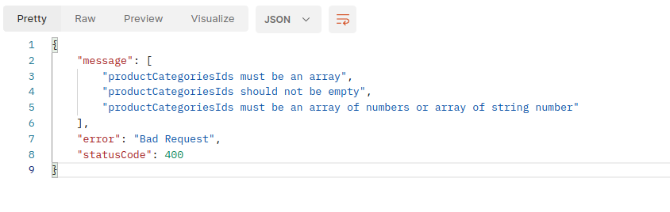

# A collection of custom decorators to make asynchronous validation in Nest JS

## Extract

This repository contains some code examples to perform data validation in NestJS using the Custom Decorators of [class-validator](https://github.com/typestack/class-validator)

- Check if an email address or username already exists in the database
- Check if for example category ids provided by the user exist in the database. This use case can be practical in a context where the user wishes to link categories to a product that he adds to the database

## Read More

Recently, I've been using Nest JS as much as possible for backend projects; and one thing that becomes recurring is the validation of data before processing. Nest JS recommends the use of Data Transfer Objects commonly called DTOs to validate user input.

```ts
export class SignupDto {
  @IsNotEmpty()
  @IsDefined()
  @IsString()
  firstName!: string;

  @IsNotEmpty()
  @IsDefined()
  @IsString()
  lastName!: string;

  @IsNotEmpty()
  @IsDefined()
  @IsEmail()
  email!: string;

  @IsNotEmpty()
  @IsDefined()
  @IsString()
  password!: string;
}
```

In a DTO class, we can call on decorators provided by class-validator to validate the properties of the class. I admit that the decorators provided by class-validator are very useful. But a need I often face the most is when the validation uses external services which makes the validation asynchronous.

Let's take this case as an example: check if the username or email address provided by the user is already linked to an existing account in the database.  At first, the method I found was to perform this check in my controller which would call a service to perform the check.

But, I quickly found this technique very restrictive; and not only that, the source code very quickly becomes a little polluted; because it has a mix of verification and business logic.

It made more sense to me to separate the asynchronous verification logic and add it to the validation step that runs before any call to a given controller's logic. For this, class-validator offers “Custom validation decorators” and it is really a practical solution.

In this article, I will present with supporting code examples 2 use cases of asynchronous validation.

- Check if an email address or username already exists in the database
- Check if, for example, category ids provided by the user exist in the database.

### Check if an email address or username already exists in the database

Using custom validation decorators to check if an element exists in a database is a very practical case. Here is a sample code:

```ts
@ValidatorConstraint({ name: "email", async: true })
export default class IsUsedEmail implements ValidatorConstraintInterface {
  async validate(value: any, args: ValidationArguments): Promise<boolean> {
    return validateUserEmail(value);
  }

  defaultMessage(args?: ValidationArguments): string {
    return `${args.property} is already used`;
  }
}

async function validateUserEmail(email: string) {
  const dataSource = [
    "bob@email.com",
    "sponge@email.com",
    "tom@email.com",
    "jerry@email.com",
  ]; // Use a real datasource linked to a database
  return new Promise<boolean>((resolve) => {
    // Asynchrone process verification
    setTimeout(() => {
      resolve(!dataSource.includes(email));
    }, 1000);
  });
}
```

To use this decorator, simply call it in your DTO with the `@Validate` decorator.

```ts
  @IsNotEmpty()
  @IsEmail()
  @Validate(IsUsedEmail)
  email: string;
```

As you have seen, it can also be coupled with other native class-validator decorators. The validation gives the following error:


Let's now move on to the second use case which is a bit atypical.

### Check if user-provided category ids exist in the database.

This use case can be practical in a context where the user wishes to link categories to a product that he adds to the database or if, for example, he wishes to link tags to an article that he wishes to publish. Here are 2 constraints that the validator must ensure to manage:

- the ids can be an array of strings or numbers or if possible both:

```ts
- ["1", "3", "5"]
- [1, 3, 5]
- ["1", 3, 7]
```

The class-validator docs offer a native decorator to validate a number written as a character string: `isNumberString`. But this decorator contains a limit and cannot handle the case defined below. Then we can decide to do the verification manually using the methods offered by class-validator, namely: `isNumber` and `isNumberString`.

- the second constraint which is the main one is to ensure that all the ids provided are available in the database.

Here is a code snippet:

```ts
@ValidatorConstraint({ name: "productCategoriesIds", async: true })
export default class IsValidProductCategoryIdArray
  implements ValidatorConstraintInterface
{
  async validate(value: any, args: ValidationArguments): Promise<boolean> {
    return validateCategoriesIds(value);
  }

  defaultMessage(args?: ValidationArguments): string {
    if (!isValidCategoriesIdsFormat(args.value)) {
      return `${args.property} must be an array of numbers or array of string number`;
    }

    return `${args.property} contains invalid category ids `;
  }
}

async function validateCategoriesIds(categoriesIds: string[] | number[]) {
  const dataSource = [
    1, 2, 3, 4, 5, 6, 7, 8, 9, 10, 11, 12, 13, 14, 15, 16, 17, 18, 19, 20, 21,
    22, 23, 24, 25, 26, 27, 28, 29, 30, 31, 32, 33, 34, 35, 36, 37, 38, 39, 40,
  ]; // Use a real datasource linked to a database

  return new Promise<boolean>((resolve) => {
    // Asynchrone process verification
    // You can also extract invalids ids and return to user.
    setTimeout(() => {
      resolve(
        isArray(categoriesIds) &&
          categoriesIds.every((categoryId) =>
            dataSource.includes(toNumberValue(categoryId))
          )
      );
    }, 1000);
  });
}

function isValidCategoriesIdsFormat(categoriesIds: any[]) {
  return (
    isArray(categoriesIds) &&
    categoriesIds.every(
      (categoryId) => isNumber(categoryId) || isNumberString(categoryId)
    )
  );
}
```

As indicated above, the isValidCategoriesIdsFormat function makes sure to check whether each value in the array is either a string or a number.

 

We can also push the use cases a little further to, for example, check if the password provided by user has already been the subject of a data leak.
